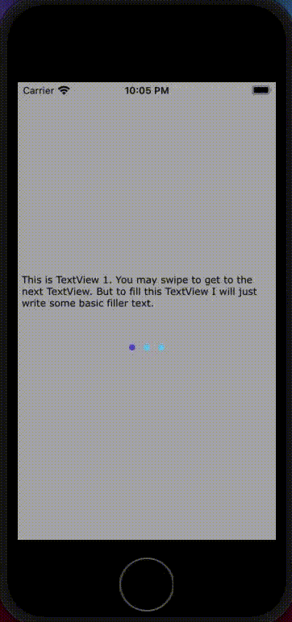

# Slideable TextViews in Swift with PageControl

## Description
Full instructions for this Widget can be found in the medium article [here](https://medium.com/@thomas_bernhard/slideable-textviews-in-swift-with-pagecontrol-17f5bddce6ff?sk=5c4739dc6e30195d379bdfe3d0fc8fd1).

## Donate
If this example repo and medium tutorial have helped you, consider buying me a coffee.

